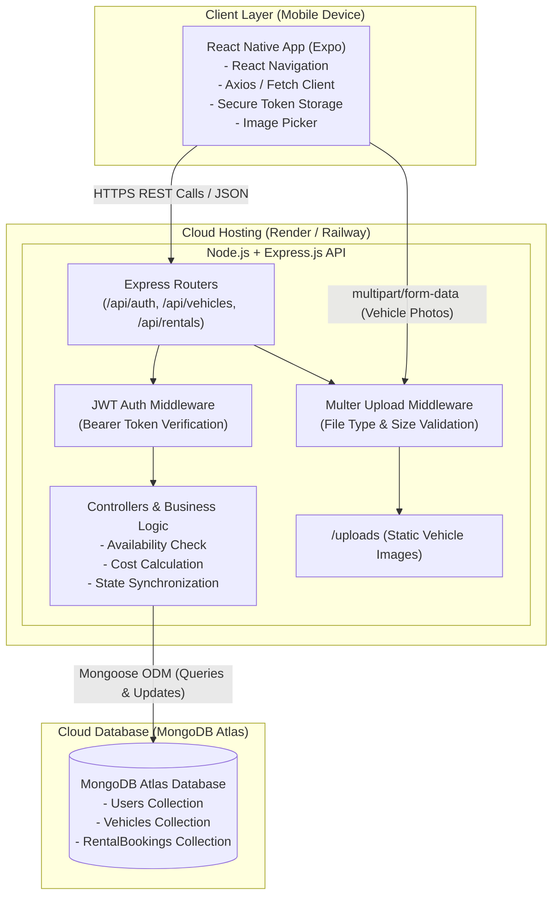
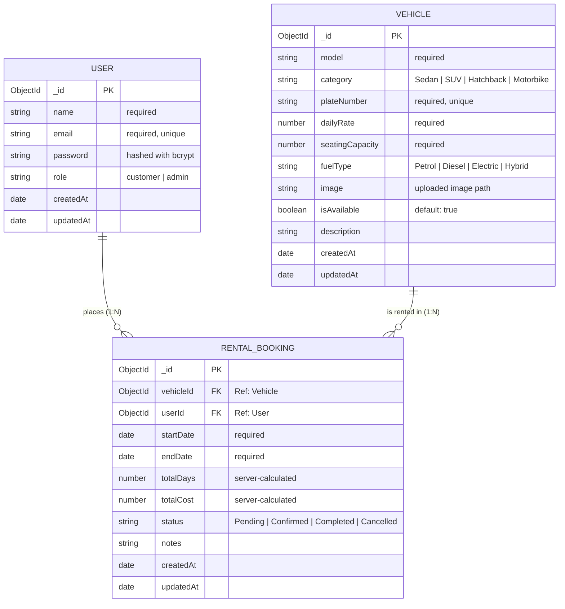

# System Architecture and Database Schema Diagrams

## 1. System Architecture Diagram

```mermaid
flowchart TD
    subgraph Client_Layer ["Client Layer (Mobile Device)"]
        RN["React Native App (Expo)\n- React Navigation\n- Axios / Fetch Client\n- Secure Token Storage\n- Image Picker"]
    end

    subgraph Cloud_Hosting ["Cloud Hosting (Render / Railway)"]
        subgraph Express_Backend ["Node.js + Express.js API"]
            Router["Express Routers\n(/api/auth, /api/vehicles, /api/rentals)"]
            AuthMid["JWT Auth Middleware\n(Bearer Token Verification)"]
            MulterMid["Multer Upload Middleware\n(File Type & Size Validation)"]
            Controllers["Controllers & Business Logic\n- Availability Check\n- Cost Calculation\n- State Synchronization"]
            LocalStorage["/uploads (Static Vehicle Images)"]
        end
    end

    subgraph Database_Layer ["Cloud Database (MongoDB Atlas)"]
        Mongo[("MongoDB Atlas Database\n- Users Collection\n- Vehicles Collection\n- RentalBookings Collection")]
    end

    RN -- "HTTPS REST Calls / JSON" --> Router
    RN -- "multipart/form-data (Vehicle Photos)" --> MulterMid
    Router --> AuthMid
    Router --> MulterMid
    MulterMid --> LocalStorage
    AuthMid --> Controllers
    Controllers -- "Mongoose ODM (Queries & Updates)" --> Mongo
```

---

## 2. Database Schema (ER Diagram)

```mermaid
erDiagram
    USER ||--o{ RENTAL_BOOKING : "places (1:N)"
    VEHICLE ||--o{ RENTAL_BOOKING : "is rented in (1:N)"

    USER {
        ObjectId _id PK
        string name "required"
        string email "required, unique"
        string password "hashed with bcrypt"
        string role "customer | admin"
        date createdAt
        date updatedAt
    }

    VEHICLE {
        ObjectId _id PK
        string model "required"
        string category "Sedan | SUV | Hatchback | Motorbike"
        string plateNumber "required, unique"
        number dailyRate "required"
        number seatingCapacity "required"
        string fuelType "Petrol | Diesel | Electric | Hybrid"
        string image "uploaded image path"
        boolean isAvailable "default: true"
        string description
        date createdAt
        date updatedAt
    }

    RENTAL_BOOKING {
        ObjectId _id PK
        ObjectId vehicleId FK "Ref: Vehicle"
        ObjectId userId FK "Ref: User"
        date startDate "required"
        date endDate "required"
        number totalDays "server-calculated"
        number totalCost "server-calculated"
        string status "Pending | Confirmed | Completed | Cancelled"
        string notes
        date createdAt
        date updatedAt
    }
```
